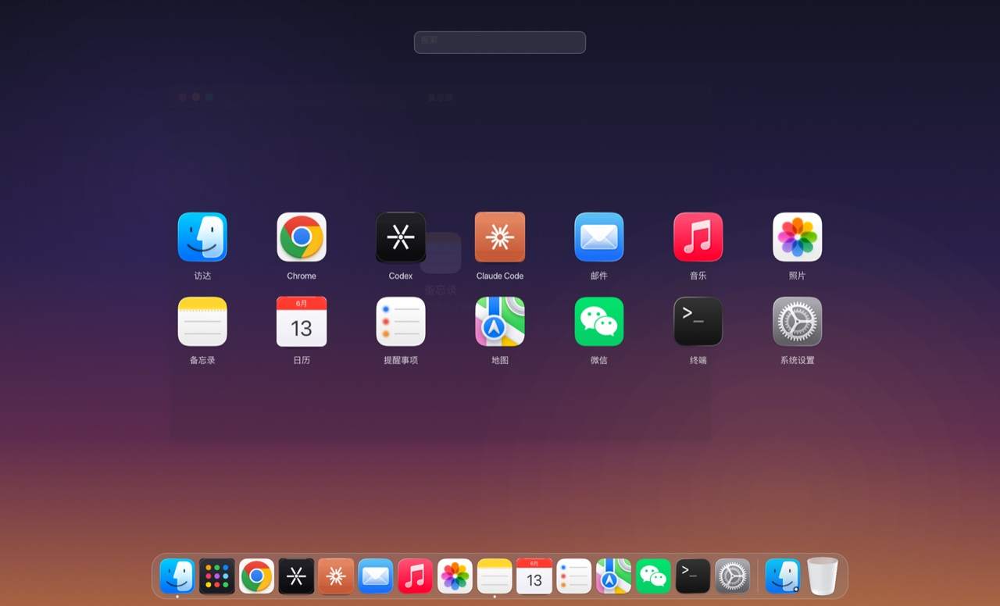
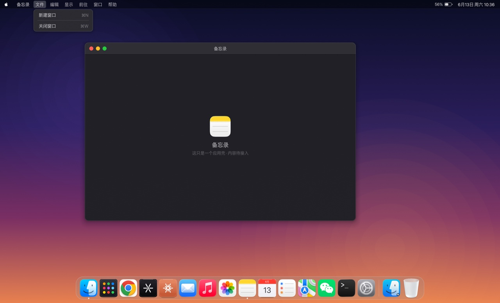
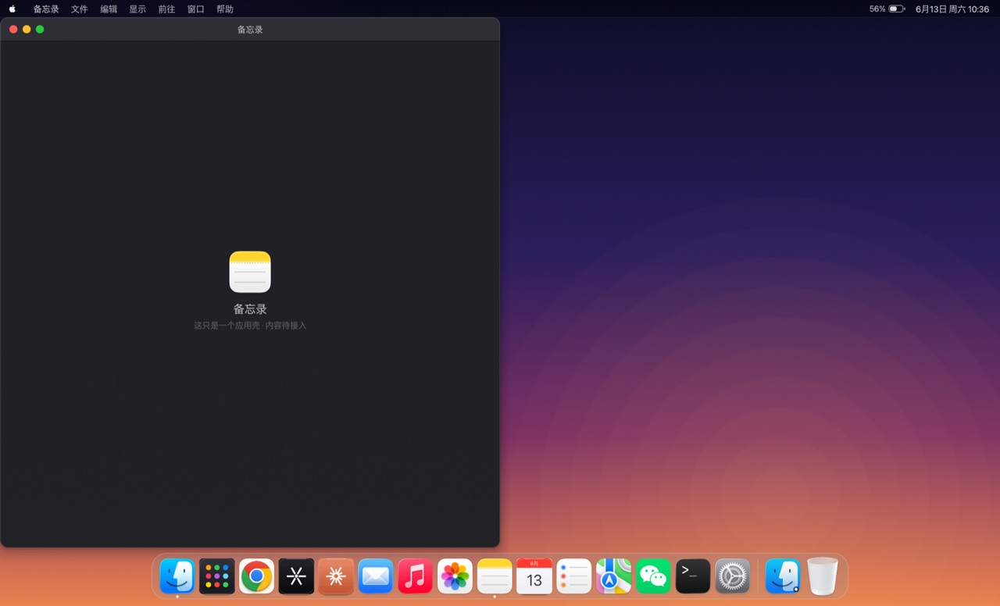
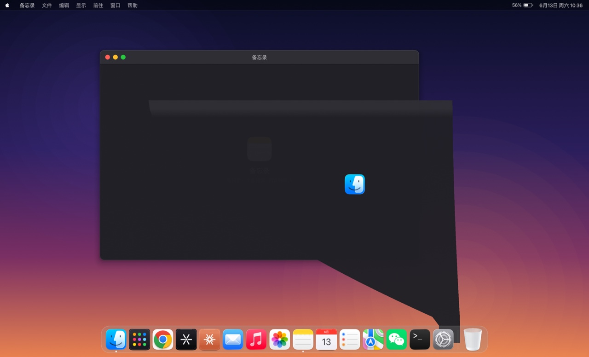
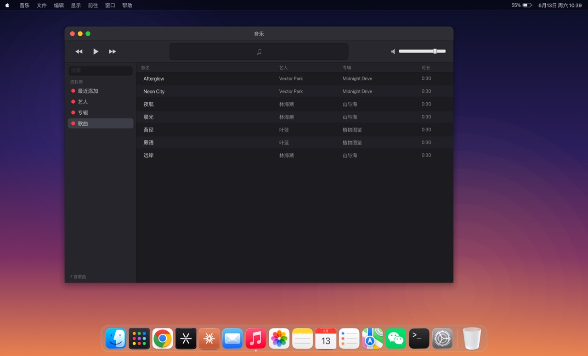
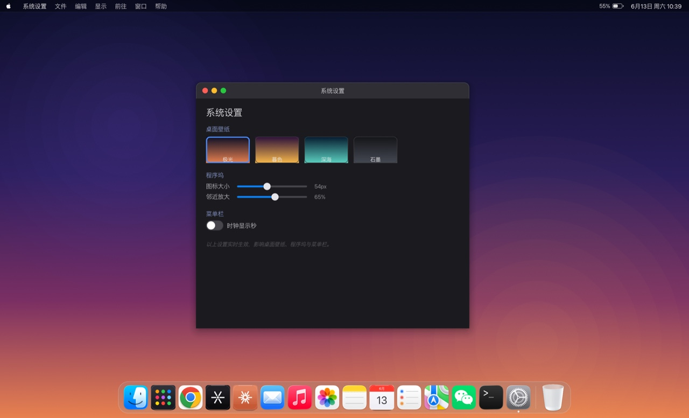
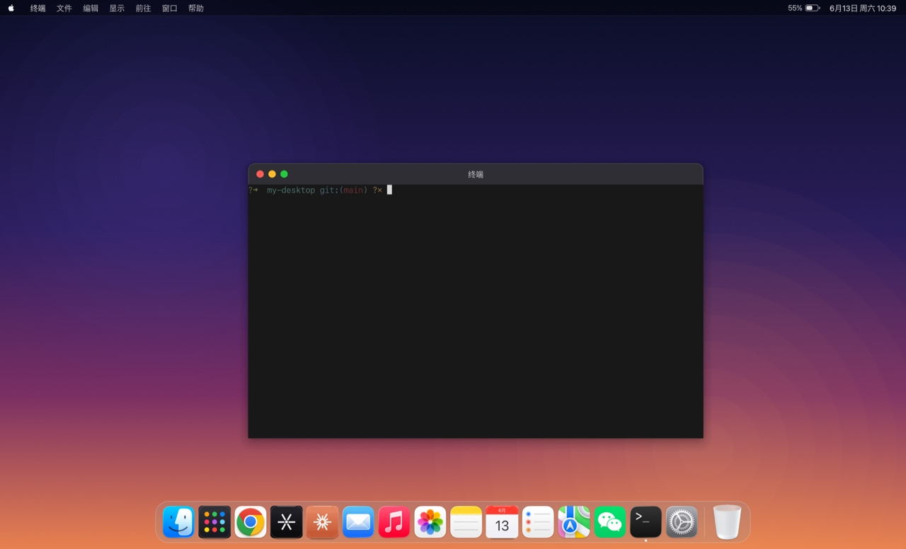
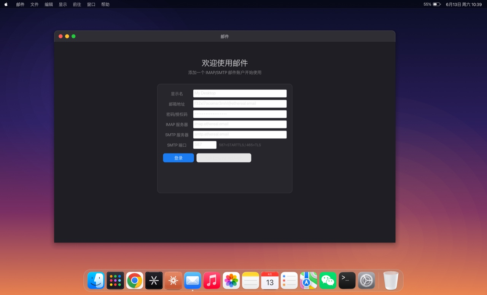

<div align="center">

# mirage

**A macOS desktop, rebuilt in Rust — the apps are shells, but the features are real**

[简体中文](README.md) · English

[](LICENSE)
[](https://github.com/emilk/egui)
[](#)



</div>

---

## What is mirage

mirage is a "desktop" running inside your Mac: a hand-drawn wallpaper, menu bar,
windows, Dock and Launchpad — modeled pixel-for-pixel on macOS (Sonoma / Sequoia
era) materials, shadows, typography and motion.

It's not a screenshot, and it's not a web mockup — **the entire desktop is rendered
in real time with [egui](https://github.com/emilk/egui) + wgpu**, every pixel painted
by hand. And what runs inside the windows isn't placeholder art either: the terminal
is a real PTY, the Agent actually chats, the file browser reads your real disk, and
the music player actually plays sound.

> In one line: **a shell as refined as macOS, with genuinely wired-up features inside.**

---

## Screenshots

### Desktop & window management

| Menu bar + desktop | Edge-snap tiling |
|:---:|:---:|
|  |  |
| Live clock, Apple menu, full dropdown menus — shortcuts actually work | Snap to edges for half-screen / quarter-screen / maximize |

<div align="center">


**Genie effect** — on minimize, the window warps into a sliced curved surface and folds into its Dock icon
</div>

### System apps

| Music | System Settings |
|:---:|:---:|
|  |  |
| **Actually plays**: rodio decodes mp3/m4a/flac, LCD display + scrubber + volume | Wallpaper themes, Dock size & magnification, clock seconds — all live |

| Terminal | Mail |
|:---:|:---:|
|  |  |
| **Real PTY**: runs your login shell — vim / htop / colors all supported | IMAP receive + SMTP send, three-pane macOS Mail layout |

---

## Features

**Desktop foundation**
- 🪟 **Window management**: title-bar drag, 8-way edge resize (with cursor shapes), click-to-focus, z-order, multiple windows per app
- 🚦 **Traffic-light buttons**: close / minimize / zoom, glyphs on hover, double-click title bar = zoom
- 🧲 **Edge-snap tiling**: half-screen on sides, quarter-screen in corners, maximize on top, with a frosted preview and a snap-back animation
- 🪄 **Genie effect**: warp-into-Dock surface deformation on minimize / restore
- 📋 **Dock**: proximity magnification wave, launch bounce, running indicators, hover tooltips, frosted panel
- 🚀 **Launchpad**: frosted-glass background + zoom-in entrance, app grid, live search filter
- 📊 **Menu bar**: full dropdown menus (highlight, shortcut labels, disabled states), live clock, Apple logo, battery
- ✨ **Unified animation**: Tween + ease-out — open/close zoom fades, tiling transitions, 150–400ms

**Genuinely wired-up apps**
- 🤖 **Codex / Claude Code**: real Agents over ACP (JSON-RPC over stdio) — Markdown rendering, collapsible thinking, tool cards, diff stats, Plan checklists, context usage
- 🌐 **Browser / Maps / WeChat**: native webviews via wry (WKWebView), real web pages
- 📁 **Finder**: browse the real filesystem — sidebar / list / breadcrumbs / double-click to open
- 🖼️ **Photos**: scans local images, grouped by year / month / day, lazy-loaded thumbnails, single-photo viewer
- 💻 **Terminal**: egui_term (Alacritty backend), real PTY
- 🎵 **Music**: rodio + symphonia, all-format decoding, cover art, seek
- 📬 **Mail**: IMAP receive + lettre send, pure synchronous threading model
- ✅ **Reminders / Trash / System Settings**: JSON persistence, `~/.Trash` browsing, live config

---

## Quick start

```bash
# Requires the Rust toolchain (rustup)
cargo run
```

> The Codex Agent needs `codex-acp` installed locally (`npm i -g @zed-industries/codex-acp`) and `codex login`.

Bundle into a `.app`:

```bash
cargo build --release
./tools/bundle.sh        # produces dist/Mirage.app
```

---

## How it works

**Render stack**: [eframe](https://github.com/emilk/egui) / egui 0.34 + wgpu backend — pure Rust, cross-platform, immediate-mode GUI.

**Architecture**: `src/wm.rs` is the **pure logic** of window management (z-order, focus, animation state machines, edge hit-testing) — zero egui dependency, unit-testable; `src/ui/` is the render + input adapter layer.

```
src/
├── main.rs        # eframe entry, input routing (menu > Dock > Launchpad > windows)
├── anim.rs        # Tween + easing, shared by all motion
├── wm.rs          # pure window-management logic (render-independent)
├── apps.rs        # app registry
├── codex.rs       # ACP client (hand-written JSON-RPC over stdio)
├── config.rs      # desktop config (wallpaper / Dock / clock)
└── ui/            # desktop / menubar / chrome / dock / launchpad
                   # + agent / browser / finder / photos / music / mail …
```

**Fidelity details**
- **Fonts**: strictly the macOS system font stack — SF Pro (Latin) / PingFang (Chinese) / SF Mono (mono) — with baseline-alignment calibration for PingFang (measured pixel-by-pixel against the real macOS menu-bar clock).
- **Controls**: no macOS control library exists in the egui ecosystem, so sliders and toggles (with slide animation) are hand-built against System Settings.
- **Icons**: reads real macOS system `.icns` first; apps with no system counterpart (Codex/Claude/Launchpad) are drawn procedurally.
- **Open source first**: egui_term for the terminal, egui_commonmark for Markdown, wry for webviews — no reinventing wheels.

---

## Roadmap

- [ ] Mission Control, multiple Spaces
- [ ] Desktop icons, right-click menus
- [ ] Real background blur (needs an offscreen blur pass at the wgpu layer)
- [ ] Real content for Notes and Calendar (currently shells)

---

## License

[Apache License 2.0](LICENSE) © 2026 chovy
