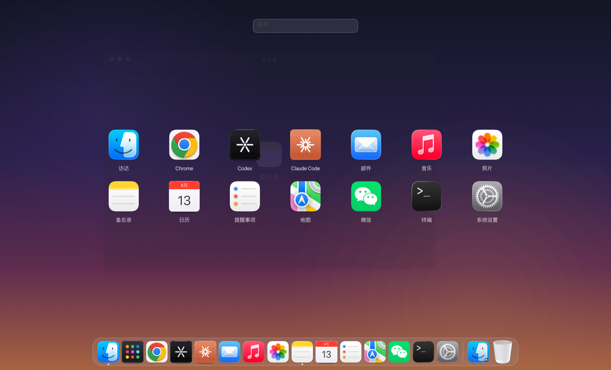
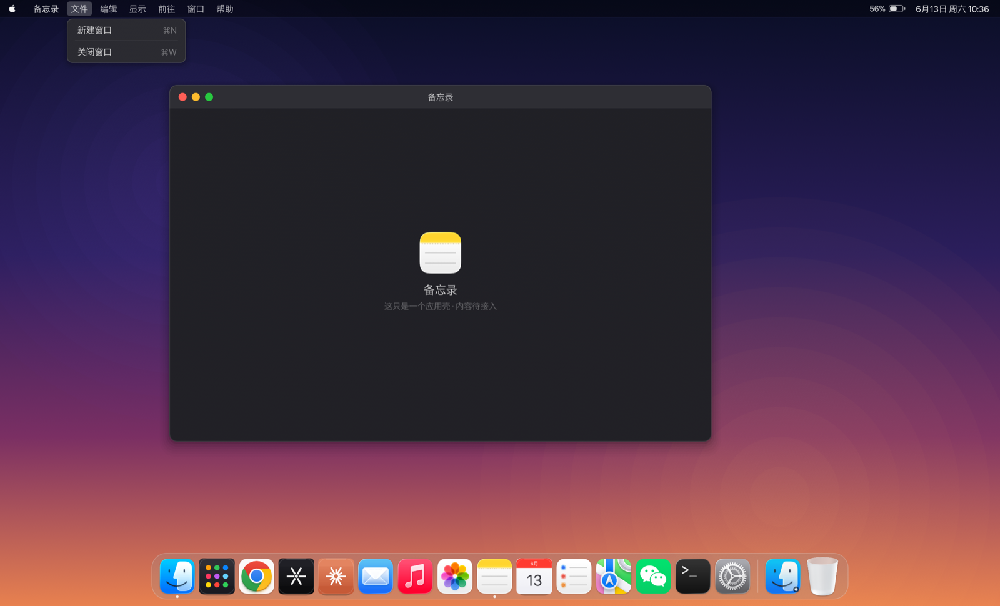
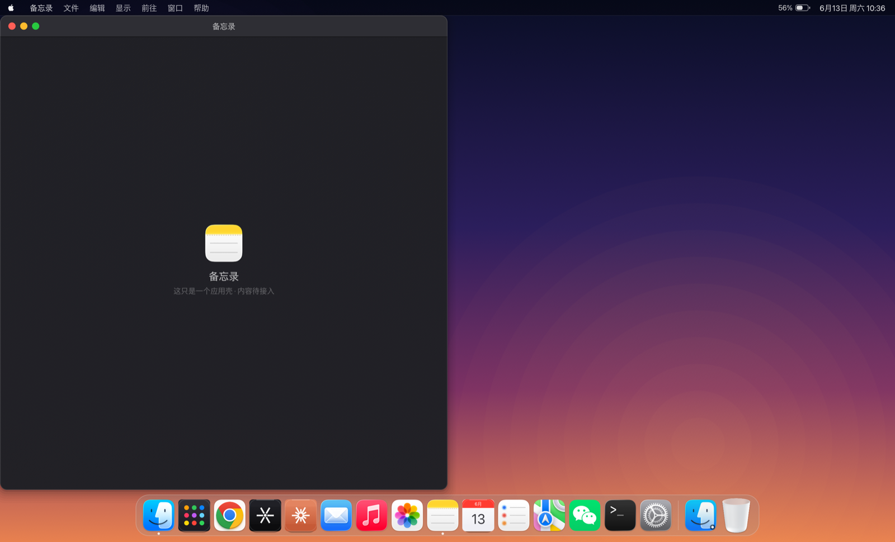
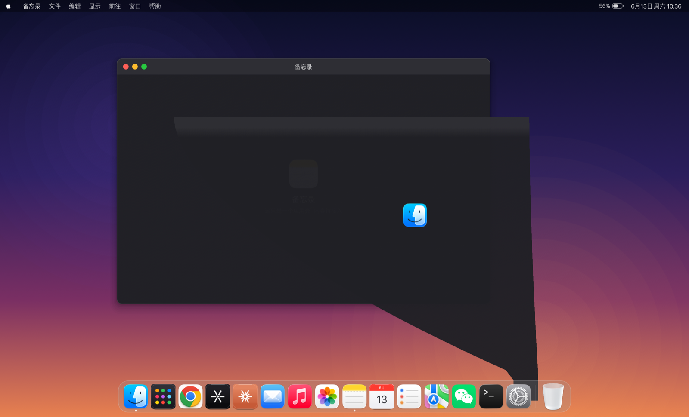
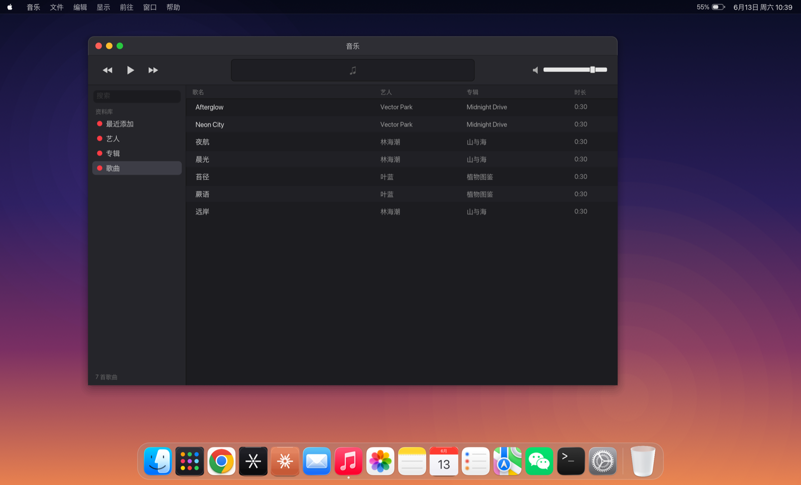
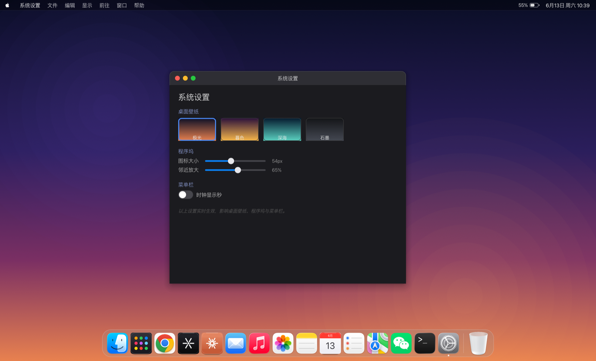
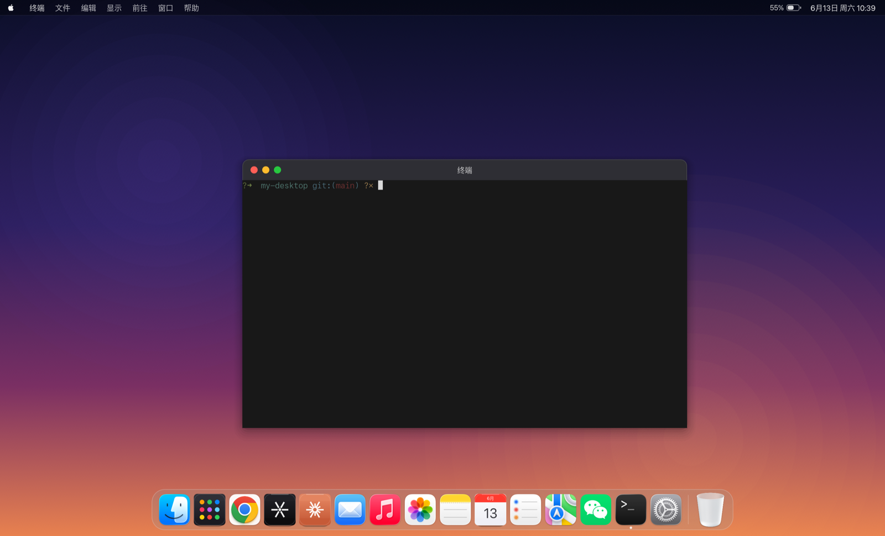
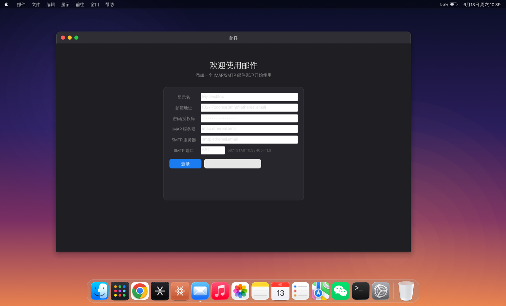

<div align="center">

# mirage

**用 Rust 复刻的 macOS 桌面 —— 应用是壳，功能是真的**

简体中文 · [English](README.en.md)

[](LICENSE)
[](https://github.com/emilk/egui)
[](#)



</div>

---

## mirage 是什么

mirage 是一台跑在你 Mac 里的「桌面」：自绘的壁纸、菜单栏、窗口、Dock 与 Launchpad，
一比一对照 macOS（Sonoma / Sequoia 代）的材质、阴影、排版与动画。

它不是截图，也不是网页仿制——**整套桌面用 [egui](https://github.com/emilk/egui) +
wgpu 实时渲染**，每个像素都是画出来的。而窗口里跑的也不是占位图：终端是真 PTY、
Agent 真能对话、文件浏览读你真实的磁盘、音乐真能放出声音。

> 一句话：**外壳像 macOS 一样精致，内核是认真接好的真实功能。**

---

## 截图

### 桌面与窗口管理

| 菜单栏 + 桌面 | 边缘吸附平铺 |
|:---:|:---:|
|  |  |
| 实时时钟、苹果菜单、下拉菜单全套，快捷键真生效 | 拖到边缘半屏 / 四角四分屏 / 顶部最大化 |

<div align="center">


**Genie 神灯动画** —— 最小化时窗口切片曲面变形，弯折后吸入 Dock 图标
</div>

### 系统应用

| 音乐 | 系统设置 |
|:---:|:---:|
|  |  |
| **真能放歌**：rodio 解码 mp3/m4a/flac，LCD 屏 + 进度条 + 音量 | 壁纸主题、Dock 大小与放大、时钟秒数，实时生效 |

| 终端 | 邮件 |
|:---:|:---:|
|  |  |
| **真 PTY**：跑你的登录 shell，vim / htop / 着色全支持 | IMAP 收信 + SMTP 发信，三栏式 macOS Mail 布局 |

---

## 核心特性

**桌面骨架**
- 🪟 **窗口管理**：标题栏拖拽、8 向边缘缩放（带光标形状）、点击聚焦置顶、z-order、同应用多窗口
- 🚦 **红绿灯按钮**：关闭 / 最小化 / 缩放，悬停显图标，双击标题栏 = zoom
- 🧲 **边缘吸附平铺**：左右半屏、四角四分屏、顶部最大化，带磨砂预览，松手动画归位
- 🪄 **Genie 神灯动画**：最小化 / 恢复时曲面变形吸入 Dock
- 📋 **Dock**：鼠标邻近放大波浪、启动弹跳、运行指示点、悬停气泡、磨砂面板
- 🚀 **Launchpad**：毛玻璃霜化背景 + 缩放入场、应用网格、实时搜索过滤
- 📊 **菜单栏**：完整下拉菜单（高亮、快捷键标注、禁用态）、实时时钟、苹果 logo、电池
- ✨ **统一动画**：Tween + ease-out，开关窗缩放淡入淡出、平铺过渡，150–400ms

**接入的真实功能**
- 🤖 **Codex / Claude Code**：ACP 协议（JSON-RPC over stdio）驱动真实 Agent，Markdown 渲染、思考折叠、工具卡片、diff 统计、Plan 清单、上下文用量
- 🌐 **浏览器 / 地图 / 微信**：wry（WKWebView）原生 webview，真实网页
- 📁 **访达**：浏览真实文件系统，侧边栏 / 列表 / 面包屑 / 双击打开
- 🖼️ **照片**：扫描本机图片，按年 / 月 / 日分组、缩略图懒加载、单张查看器
- 💻 **终端**：egui_term（Alacritty 后端），真 PTY
- 🎵 **音乐**：rodio + symphonia，全格式解码、封面、进度拖动
- 📬 **邮件**：imap 收信 + lettre 发信，纯同步线程模型
- ✅ **提醒事项 / 回收站 / 系统设置**：JSON 持久化、`~/.Trash` 浏览、实时配置

---

## 快速开始

```bash
# 需要 Rust 工具链（rustup）
cargo run
```

> Codex Agent 需本机已装 `codex-acp`（`npm i -g @zed-industries/codex-acp`）并 `codex login`。

打包成 `.app`：

```bash
cargo build --release
./tools/bundle.sh        # 产出 dist/Mirage.app
```

---

## 技术实现

**渲染栈**：[eframe](https://github.com/emilk/egui) / egui 0.34 + wgpu 后端，纯 Rust、跨平台、即时模式 GUI。

**架构原则**：`src/wm.rs` 是窗口管理的**纯逻辑**（z-order、焦点、动画状态机、边缘命中），零 egui 依赖、可单测；`src/ui/` 是渲染与输入适配层。

```
src/
├── main.rs        # eframe 入口、输入路由（菜单 > Dock > Launchpad > 窗口）
├── anim.rs        # Tween + easing，所有动效共用
├── wm.rs          # 窗口管理纯逻辑（不依赖渲染）
├── apps.rs        # 应用注册表
├── codex.rs       # ACP 客户端（手写 JSON-RPC over stdio）
├── config.rs      # 桌面配置（壁纸 / Dock / 时钟）
└── ui/            # desktop / menubar / chrome / dock / launchpad
                   # + agent / browser / finder / photos / music / mail …
```

**还原细节**
- **字体**：严格用 macOS 系统字体栈——SF Pro（西文）/ 苹方（中文）/ SF Mono（等宽），并对苹方做了基线对齐校准（对照真 macOS 菜单栏时钟逐字测量像素上下沿）。
- **控件**：egui 生态没有现成 macOS 控件库，对照 System Settings 自建了滑杆与开关（带滑动动画）。
- **图标**：优先读取 macOS 系统真实 `.icns`，无系统对应物的（Codex/Claude/Launchpad）走程序化精绘。
- **开源优先**：终端用 egui_term、Markdown 用 egui_commonmark、webview 用 wry，不重复造轮子。

---

## 路线图

- [ ] Mission Control、多桌面 Spaces
- [ ] 桌面图标、右键菜单
- [ ] 真实背景模糊（需在 wgpu 层加离屏 blur pass）
- [ ] 备忘录、日历的真实内容（目前是壳）

---

## 许可证

[Apache License 2.0](LICENSE) © 2026 chovy
